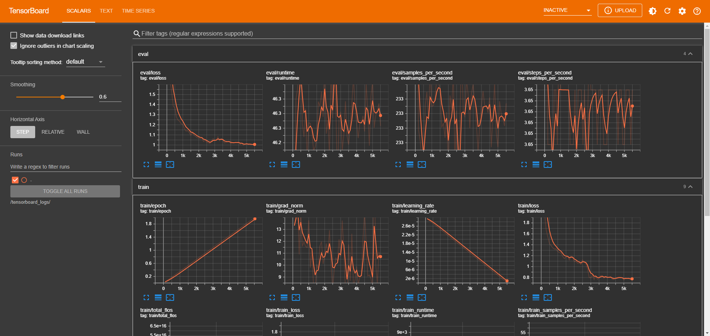

# Fine-tune BERT on SQuAD

> Fine-Tuning BERT for Question-Answering on Kubeflow.

 

This repository contains the code for fine-tuning BERT on the SQuAD dataset to
solve Question-Answering tasks. The code can run locally, on a GPU Notebook
server, or leverage [Kubeflow Pipelines (KFP)](https://www.kubeflow.org/docs/components/pipelines/)
to scale and automate the experiment in a Kubeflow cluster.

 

## Approach

- Model Selection: I am using Hugging Face's ecosystem to fine-tune the
  pre-trained BERT model ([bert-base-uncased](https://huggingface.co/google-bert/bert-base-uncased)).
  The model was fine-tuned using the [SQuAD dataset](https://huggingface.co/datasets/rajpurkar/squad).
- Evaluation: The model was evaluated using metrics such as exact match (EM)
  and F1 score to assess how well it identified the correct span of the answer
  from the context.

## Results

The fine-tuned model achieved:

| Metric | Value  |
|--------|--------|
| EM     | 79.81  |
| F1     | 87.49  |

## Challenges

- Handling longer contexts: One of the key challenges encountered was the
  handling of longer contexts, as BERT's input size is limited to 512 tokens.
  Truncating or splitting contexts sometimes led to partial or incorrect
  answers.
- Fine-tuning on smaller datasets resulted in overfitting, requiring careful
  hyperparameter tuning and regularization techniques. Stopping after `2` epochs
  of training is sufficient.
- The computational resources required for fine-tuning were significant,
  necessitating the use of at least one GPU device for optimal training speed.
  The whole training process took around 50 minutes on a single GPU. I
  recommend using a GPU with at least `12GB` of memory and if possible,
  distribute the training across multiple GPUs. The Kubeflow Pipeline Notebook
  can be a starting point for scaling the experiment.

# About BERT

[BERT (Bidirectional Encoder Representations from Transformers)](https://arxiv.org/abs/1810.04805)
is a revolutionary model developed by Google in 2018. Its introduction marked a
significant advancement in the field, setting new state-of-the-art benchmarks
across various NLP tasks.

BERT is pre-trained on a massive amount of data, acquiring a sense of what
language is and what's the meaning of context in a document. Then, this
pre-trained model can then be fine-tuned for specific tasks such as sentiment
analysis or question answering.

# About SQuAD

[Stanford Question Answering Dataset (SQuAD)](https://rajpurkar.github.io/SQuAD-explorer/)
is a reading comprehension dataset, consisting of questions posed by
crowdworkers on a set of Wikipedia articles, where the answer to every question
is a segment of text, or span, from the corresponding reading passage, or the
question might be unanswerable.

SQuAD `1.1`, the previous version of the SQuAD dataset, contains 100,000+
question-answer pairs on 500+ articles.

# How to use this repository

This repository contains the following files:

- `bert-squad.ipynb`: Jupyter Notebook to fine-tune BERT on SQuAD.
- `pipeline.ipynb`: Jupyter Notebook to create, compile, and submit a Kubeflow
   Pipeline for the experiment.

To run the code locally, you can use the Jupyter Notebook `bert-squad.ipynb`.
You will need a GPU to run the notebook, as BERT is computationally expensive.

If you have access to a Kubeflow cluster, you can use the `pipeline.ipynb` to
create, compile, and submit a Kubeflow Pipeline to fine-tune BERT. The pipeline
will scale the experiment across multiple nodes in the cluster, running steps in
parallel, and caching repeated ones to save time and resources.

For more information on how to use the notebooks, please refer to the
[documentation](https://dpoulopoulos.github.io/bert-qa-finetuning/).
