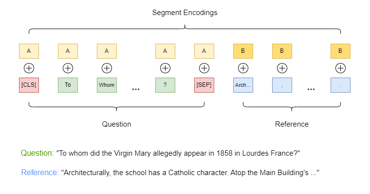
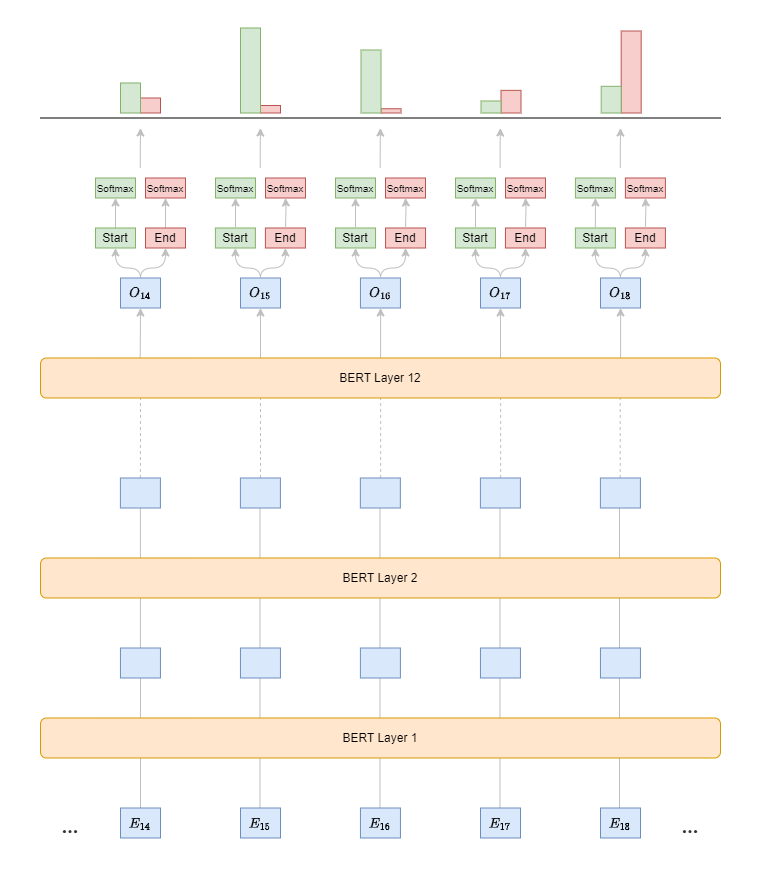

# BERT for Question Answering

Once pre-trained, we can specialize BERT on a specific task using a smaller
labeled dataset. For example, let's take a closer look at the Q&A task:

Fine-tuning BERT for Question Answering (Q&A) tasks, such as the
[Stanford Question Answering Dataset (SQuAD)](https://rajpurkar.github.io/SQuAD-explorer/),
involves adjusting the model to predict the start and end positions of the
answer in a given passage for a provided question. Here are the steps to
fine-tune BERT for such tasks:

1. **Dataset Preparation**:
    - Define each dataset item with a question, a passage (or context), and the
      start and end positions of the answer within the passage as the label.
    - Tokenize both the question and passage into subwords using BERT's
      tokenizer. Separate the question from the passage using the `[SEP]` token
      and start the input sequence with the `[CLS]` token.
    - Mark the question as segment `A` (or `0`) and the context as segment `B`
      (or `1`). Use this information to learn different embeddings for each
      segment, which are added to the word embeddings.
    
    

1. **Model Modification**:
    - Extract embeddings for each token in the sequence from the pre-trained
      BERT model.
    - Add a dense (fully connected) layer on top of BERT, with two output nodes:
      one for predicting the start position and one for predicting the end
      position of the answer in the passage (see [code](https://github.com/huggingface/transformers/blob/c385de24414e4ec6125ee14c46c128bfe70ecb66/src/transformers/models/bert/modeling_bert.py#L1803)).
1. **Training Objective**:
    - Output a score for each token in the passage, indicating how likely that
      token is the start of the answer, and another score for the end.
    - Apply a SoftMax function over the sequence to get a probability
      distribution for the start and end positions.
    - Use the sum of the negative log likelihood of the correct start and end
      positions as the loss function.

    

1. **Training**:
    - Initialize training with pre-trained BERT weights.
    - Apply a smaller learning rate (e.g., 2e-5 or 3e-5) since BERT is
      already pre-trained. Avoid using a larger learning rate, as it may cause
      the model to diverge.
    - Fine-tune the model on the Q&A dataset for several epochs, stopping when
      validation performance plateaus or decreases.
1. **Inference**:
    - Tokenize a new question and passage, and add the special `[CLS]` and
      `[SEP]` tokens.
    - Feed the tokens into the fine-tuned BERT model to get scores for the start
      and end positions of the answer.
    - Select the tokens between the predicted start and end positions as the
      final answer.
    - Apply constraints such as ensuring the end position is after the start and
      limiting the maximum answer length.
1. **Evaluation**:
    - Measure performance using common metrics like Exact Match (EM), which
      calculates the percentage of predictions that exactly match the ground
      truth and the F1 score to account for partial matches by considering
      overlapping words between the prediction and ground truth.
