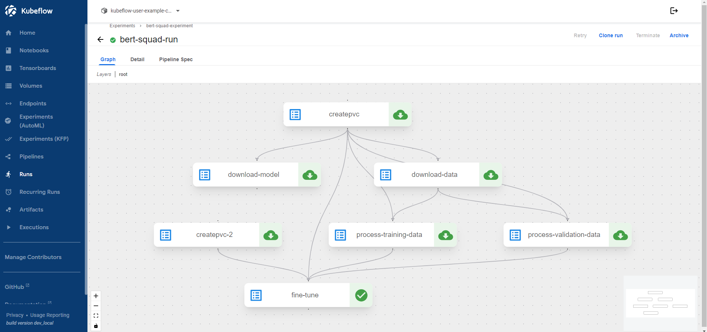

# Kubeflow Pipelines

This guide will take you step-by-step through the process of fine-tuning BERT on
the SQuAD dataset, leveraging
[Kubeflow Pipelines](https://www.kubeflow.org/docs/components/pipelines/) to
scale and automate the experiment in a [Kubeflow](https://www.kubeflow.org)
cluster.

There are several advantages to this approach compared to running the experiment
locally:

- 🚀 Scale your runs by leveraging more resources and more powerful machines.
- 🎏 Parallelize steps that can run independently.
- 🫙 Cache steps, such as data processing, to avoid repeating them on each run.
- 📅 Schedule recurring runs to retrain your model periodically.
- 📈 Track and visualize the experiment's configuration.
- ✨ Automate model deployment by integrating KFP with CI/CD pipelines once.

Here's how a complete pipeline looks like:



## What you'll need

Before you start, make sure you have the following:

- A working Kubeflow deployment. Visit the
  [VirtML](https://github.com/dpoulopoulos/virtml) project page to find out how
  you can create a local Kubeflow deployment.
- A basic understanding of Kubeflow Pipelines. If you're new to KFP, check the
  [official documentation](https://www.kubeflow.org/docs/components/pipelines/).

## Procedure

1. Create a new Jupyter Notebook in your Kubeflow Notebook server. Make sure
   that the server can submit pipelines to the Kubeflow cluster.

1. Connect to the Jupyter Notebook server.

1. Launch a temrinal window and clone the repository:

    ```console
    user:~$ git clone https://github.com/dpoulopoulos/bert-qa-finetuning.git
    ```

1. Navigate to the project directory:

    ```console
    user:~$ cd bert-qa-finetuning
    ```

1. Install the required packages:

    ```console
    user:~/bert-qa-finetuning$ pip install -r requirements.txt
    ```

1. Open the `pipeline.ipynb` notebook.

1. Follow the instructions in the notebook to create, compile, and submit a
   Kubeflow Pipeline for fine-tuning BERT on the SQuAD dataset.

1. Create a TensorBoard instance to monitor the training process. You can submit
   the following YAML manifest, or use the UI to create one:

    ```yaml
    apiVersion: tensorboard.kubeflow.org/v1alpha1
    kind: Tensorboard
    metadata:
      name: bert-squad-logs
      namespace: kubeflow-user-example-com
    spec:
      logspath: pvc://bert-squad/logs
    ```

1. Access the TensorBoard instance to monitor the training process.

  

## Next steps

Congratulations! You've successfully created and submitted a Kubeflow Pipeline
to fine-tune BERT on the SQuAD dataset. You can now scale and automate the
experiment in your Kubeflow cluster.
